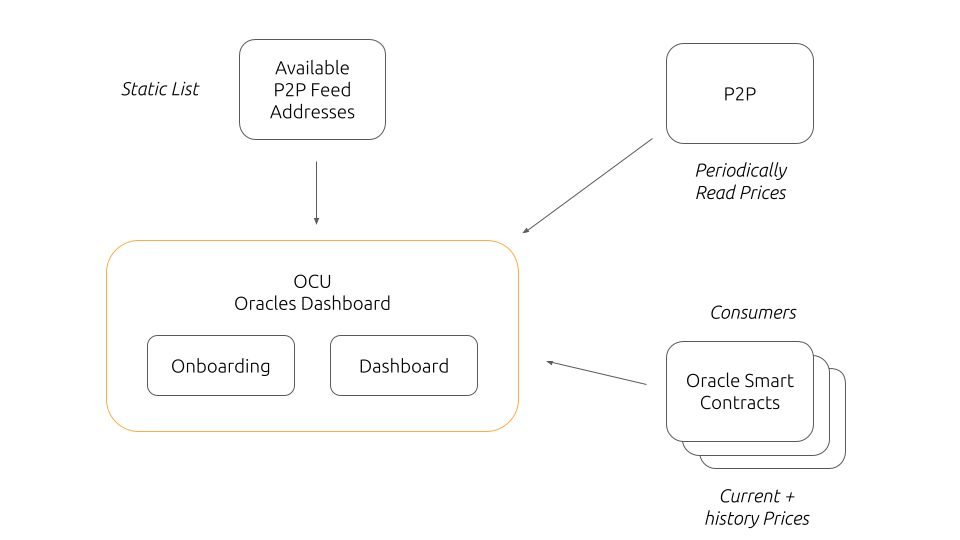

# MOCUDA: Maker Oracles Core Unit Dashboard

WIP: https://mocuda.pages.dev/

## Idea

Create an entry point for Maker Oracle Consumers by providing several interesting information for the users.

## Deployment

### Frontend

[Merge to Live](https://github.com/web3nao/mocuda/compare/live...main?expand=1)

## Useful Links

- Slides to discuss MVP: [Google Doc](https://docs.google.com/presentation/d/17DbYG1u-Ii7Krky28FbvLd3quCVh7-vR2Z_OqDxiCgg/edit#slide=id.g126f966e658_0_23)
- As comparison: [Chainlink](https://data.chain.link/)
  - [ETH / USD](https://data.chain.link/ethereum/mainnet/crypto-usd/eth-usd)
- OCU Hack project from the past: [https://oracles-dashboard.vercel.app/](https://oracles-dashboard.vercel.app/)
- Maker Oracles Subgraph: [https://github.com/madumas/maker-oracles-subgraph](https://github.com/madumas/maker-oracles-subgraph)
- Dune Report: [Maker Oracle Costs](https://dune.com/madumas/Maker-Oracle-Costs?2.%20Start%20Date=2021-08-01%2000%3A00%3A00)

## Project Structure

### Data Source: `libp2p`

`spire` is a tool by Oracles Core Unit to fetch prices via libp2p.

- [Spire Binary](./spire/): executable to fetch prices
- [Fetched Data](./data/): Github Action runs once per hour to fetch new prices
- [Price Data Transformation](./data-transformation/): Github Action aggregates and transforms data to easily use in Frontend
- TODO: upload to filebase: see https://docs.filebase.com/configurations/third-party-configurations/backup-client-configurations/s3-uploader-for-github-actions

Feeds: [https://raw.githubusercontent.com/web3nao/mocuda/main/data/feeds.json](https://raw.githubusercontent.com/web3nao/mocuda/main/data/feeds.json)
Example ETHUSD: [https://raw.githubusercontent.com/web3nao/mocuda/main/data/feeds/ETHUSD.json](https://raw.githubusercontent.com/web3nao/mocuda/main/data/feeds/ETHUSD.json)

### Data Source: `subgraph-ocu`

Forked Subgraph by Maker Oracles: updated to work with latest `graphcli`. Indexes all Events and Function calls related to the Oracles Smart Contracts. Has no history of price data.

Subgraph: [https://thegraph.com/hosted-service/subgraph/urbanisierung/makerdao-ocu](https://thegraph.com/hosted-service/subgraph/urbanisierung/makerdao-ocu)

### Data Source: `subgraph-lite`

Dedicated subgraph to index price data related to Oracles Smart Contracts. Stores latest 250 events (price updates) per Smart Contract.

Subgraph: [https://thegraph.com/hosted-service/subgraph/urbanisierung/ocu-eth-usd](https://thegraph.com/hosted-service/subgraph/urbanisierung/ocu-eth-usd)

### Further Sources

- Coin Icons: [https://github.com/ErikThiart/cryptocurrency-icons](https://github.com/ErikThiart/cryptocurrency-icons)
